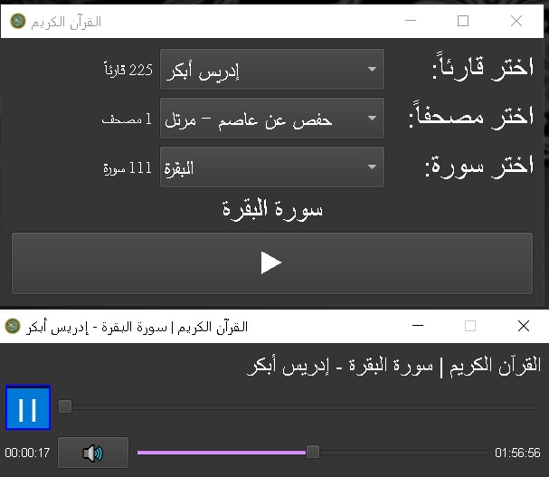
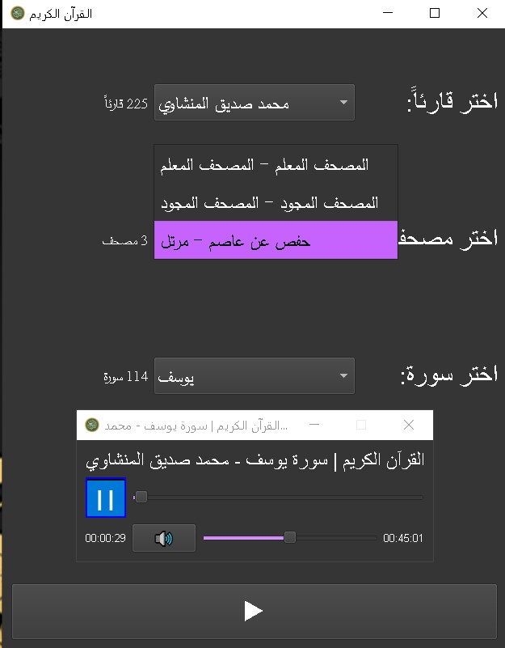
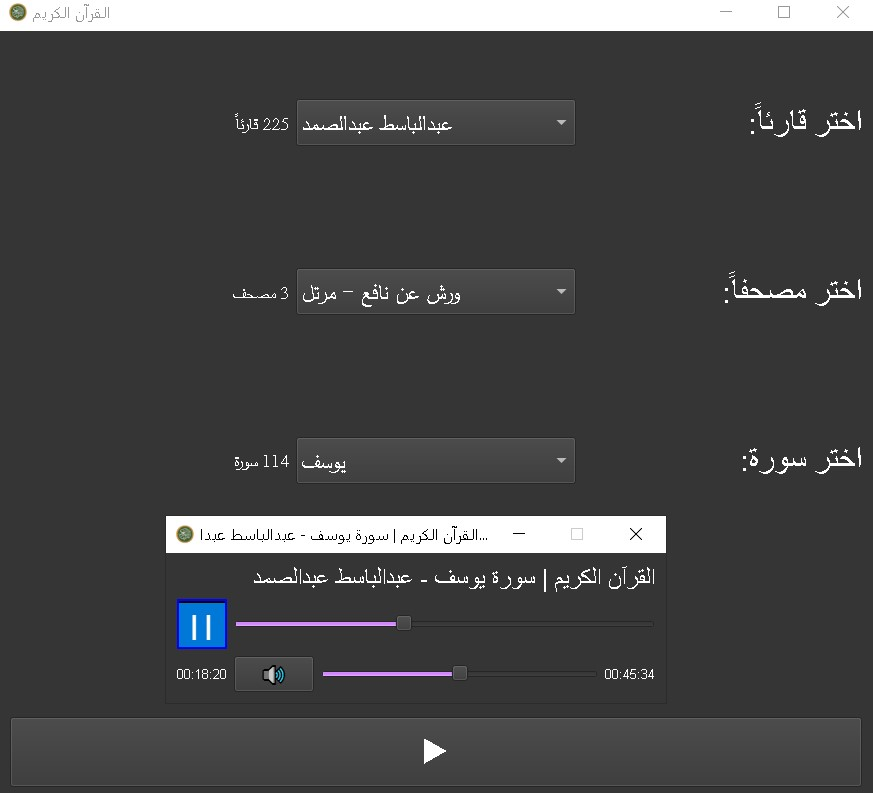
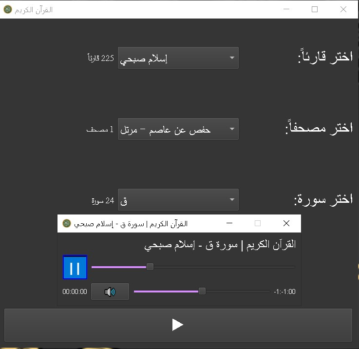
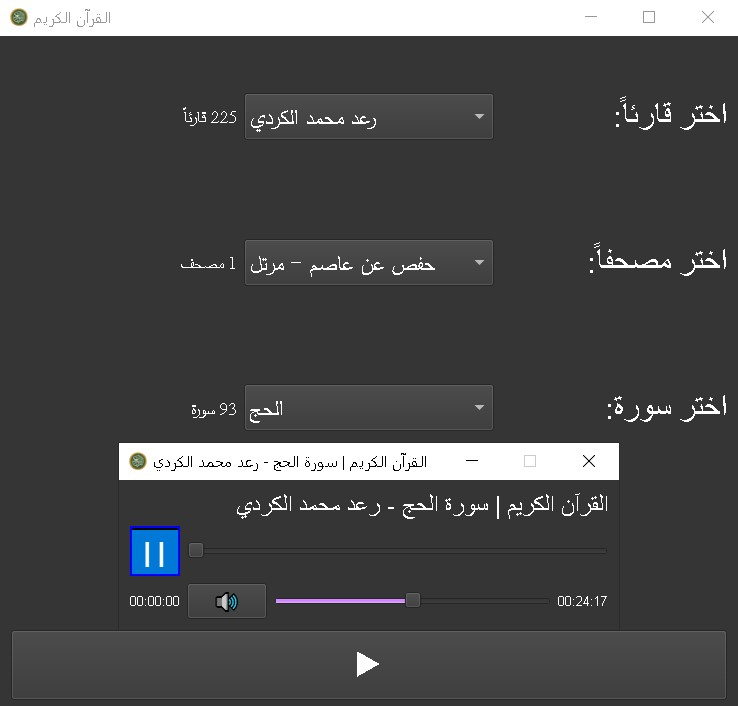
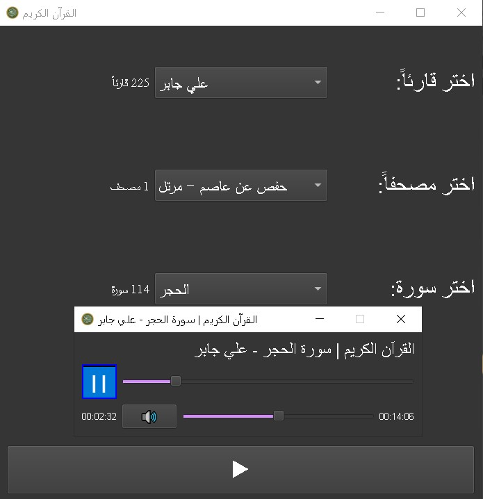

## Ring Quran Application for Ring Programming Language

## برنامج القرآن الكريم للغة البرمجة رينج

### made by : Mohannad Al-Ayash < mohannadazazalayash@gmail.com >

### < mohannadazazalayash@gmail.com > المؤلف: مهند العياش

### screen shots
| Image 1 | Image 2 | Image 3 | Image 4 |
|---------|---------|---------|---------|
 |  |  | 

### How To Run (don't have Ring Programming Language)

#### (1) Download Ring Programming Language and configure it for your machine

#### (2) Run This Command

    ring Quran_ringController.ring

### How To Run (have Ring Programming Language)

#### (1) Run this Command

    ringpm install quran_ring from mohannad-aldulaimi

#### (2) Then Run This Command

    ringpm run quran_ring

### Important notes :

#### (1) this application depends on the mp3 quran api:

    https://mp3quran.net/ar/api

#### (2) Any updates of the authors of this api for reciters,moshafs or sowers will updated directly without any update or batch.

#### (3) fell free of using this application,and develop the source code or share it ,but you have to mention that it was made using Ring Programming Language.

### اللهم اجعله عملاََ خالصاََ لوجهك عني وعن والدي وعن كل من نشر او استمع

### Ph. & Dev. Mohannad Alayash (21/12/2023)
